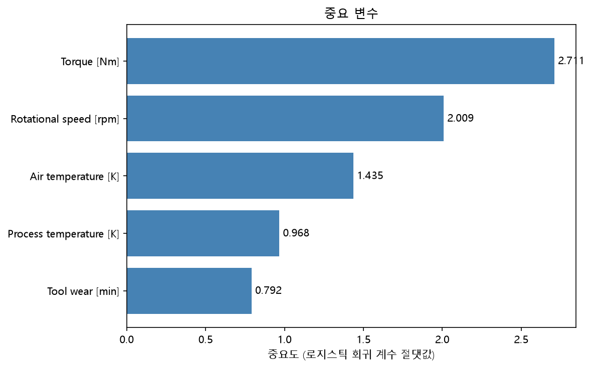
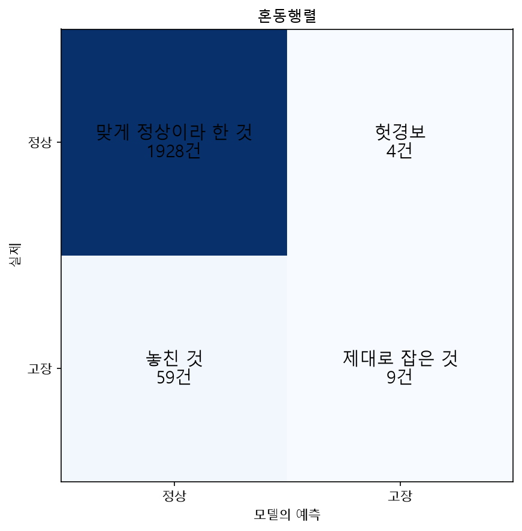
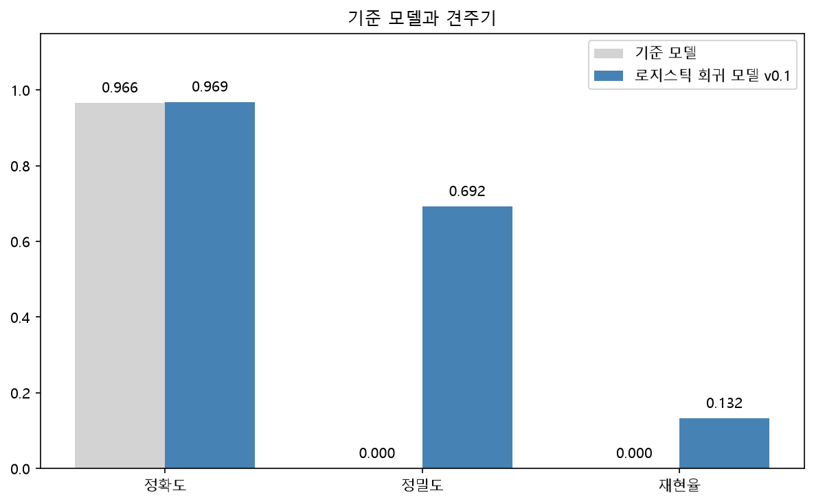

# 설비 고장 예측 (project_v1)

## 문제

설비의 측정값(공기온도·공정온도·회전속도·토크·공구마모)으로, 오늘 가동하는 설비 중 고장 위험이 높은 순서를 매긴다

## 이 판단은 누가, 언제, 어떻게 쓰나

| 물음 | 내 답 |
|---|---|
| 누가 쓰나 | 생산 라인 관리자 |
| 무엇을 결정하나 | 오늘 어떤 설비부터 순회 점검할지 순서 |
| 언제 결정하나 | 매일 가동 시작 전, 그날의 측정값이 모였을 때 |
| 이 판단이 늦으면 | 우선순위가 낮은 설비부터 보다가, 정작 위험한 설비의 고장을 늦게 발견한다 |

## 데이터 출처

수업에서 받은 정제본. 이 저장소에는 데이터 파일이 포함되어 있지 않습니다.

## 사용 데이터

- 규모: 10,000행×7열
- 결과 열: Machine failure(정상·고장)
- 드문 쪽 비율: 고장 339건(3.39%)

## 모델 비교

| | 정확도 | 정밀도 | 재현율 | 지목 | 그중 진짜 | 핵심 요약 |
|---|---|---|---|---|---|---|
| 기준 모델 | 96.6% | - (아예 지목 안 함) | 0 | 0 | 0 | 전부 정상이라고만 답해, 고장을 하나도 잡아내지 못함 |
| 로지스틱 회귀 모델 v0.1 | 96.85% | 0.692 | 0.132 | 13 | 9 | 지목한 13건 중 9건은 맞았지만, 실제 고장 68건 중 9건만 잡아냄 |
| 가중치 모델 v0.1 | 82.1% | 0.141 | 0.838 | 404 | 57 | 지목을 404건으로 크게 늘려 실제 고장 68건 중 57건을 잡아냈지만, 헛걸음도 13건에서 404건으로 크게 늘어남 |

## 결과 그림

## 한 줄 요약

정확도는 기준 모델과 비슷하지만, 로지스틱 회귀 모델 v0.1 혼자서는 실제 고장을 잡아내는 능력(재현율)이 낮았다. class_weight="balanced"를 넣은 가중치 모델 v0.1은 재현율을 0.838까지 크게 올렸지만, 그만큼 헛걸음(정밀도 하락)도 늘어나는 맞교환이 확인됐다.

## 한계

1. 실제 고장의 상당수를 놓친다 — 정밀도와 재현율 중 어디에 무게를 둘지 아직 정하지 못했다
2. 왜 고장 위험이 높다고 판단했는지 이유(어떤 측정값이 크게 작용했는지)를 보여주지 않는다
3. 지금 가진 데이터 안에서만 확인한 결과라, 다른 시기·다른 설비에도 똑같이 통할지는 검증되지 않았다
